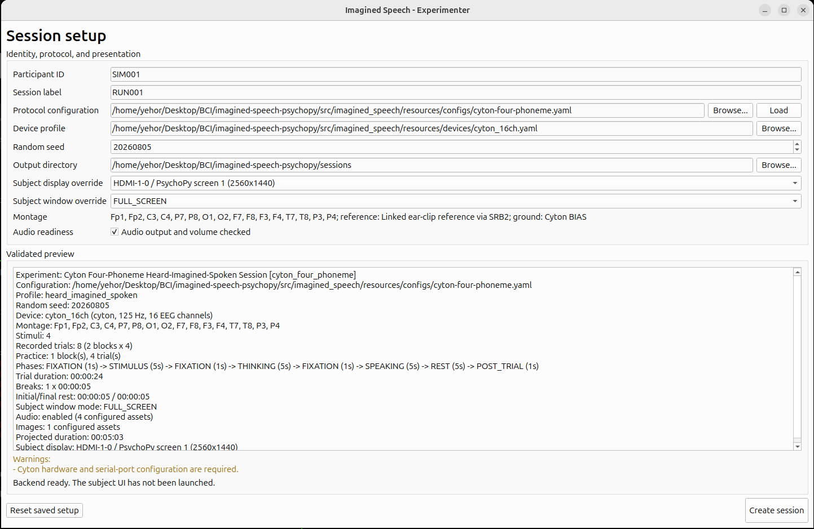
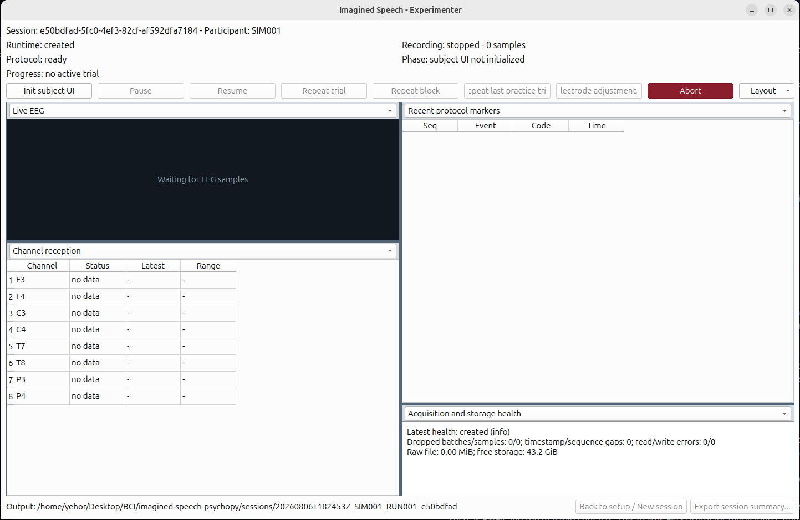
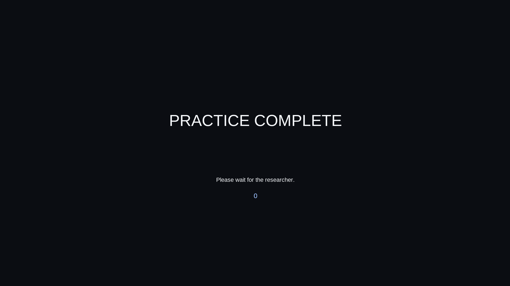
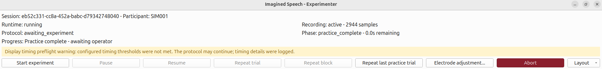
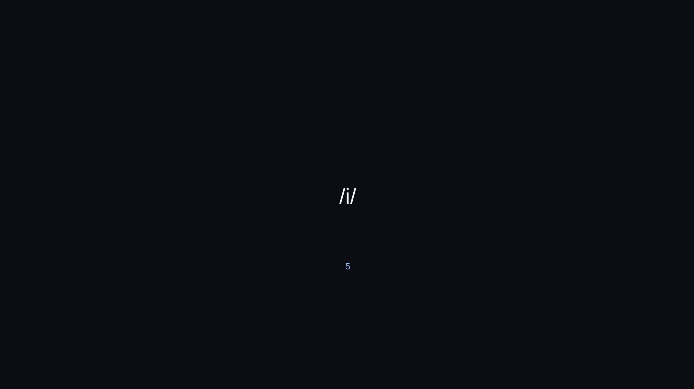
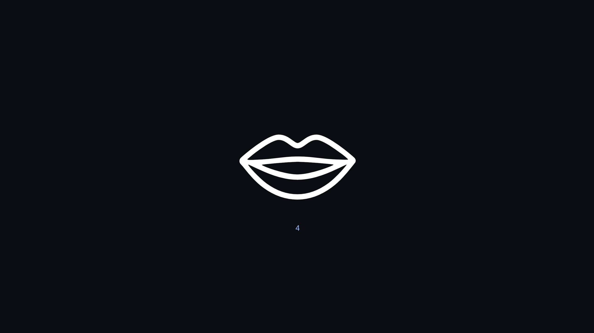
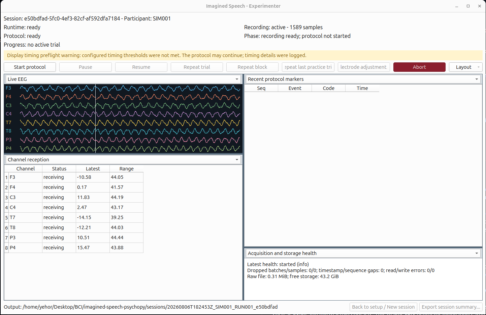

# Imagined-speech experiment

## Description

This document describes how to set up and run an imagined-speech EEG
experiment that is used to collect EEG recordings while a
participant performs imagined-speech tasks. The experimenter operates the
recording application and the participant follows the instructions shown in
the PsychoPy subject display.
The application records the experiment protocol, timing information, markers,
acquisition status, operator actions, and raw EEG data in a session package.

The current implementation does **not** include or provide a tool for
processing the results of the imagined-speech experiment. In particular, it
does not provide the analysis pipeline needed to turn the recorded EEG into
imagined-speech classifications or other scientific results. The experimenter
must therefore treat the output as recorded research data that requires a
separate processing workflow.

## Prerequisites and installation

The experimenter should be comfortable using a terminal and following setup
instructions, but does not need to have written the application code.

The supported environment is 64-bit Windows with Python 3.11. Install and run
the application from the `imagined-speech-psychopy` project. The project
README contains the complete installation instructions, optional dependency
groups, launch commands, configuration options, and session-output details:

[Installation and usage guide for `imagined-speech-psychopy` ](../imagined-speech-psychopy/README.md)

## Ensuring data quality and integrity

Because result processing is not implemented for this experiment, extra care
is needed during setup and data collection. This is especially important when
the experimenter has limited experience running EEG experiments. Before
collecting imagined-speech data, read and complete the workflow described in
the [SSVEP experiment documentation](SSVEP_EXPERIMENT.md).

The SSVEP experiment provides a full, deterministic flow for gathering,
processing, and validating data. Running it first will teach the experimenter
how to set up the hardware and software, operate a session, inspect the
recorded data, and verify that stimulus timing and acquisition are behaving as
expected. It also provides a practical reference for ensuring that the data
recorded in this imagined-speech experiment meets data-quality requirements at
least on par with the data that produces usable results in the SSVEP
experiment.

At minimum, use the SSVEP workflow to become familiar with:

- preparing and checking the recording environment;
- starting and controlling an experiment session;
- confirming that markers, timing, and acquisition remain healthy;
- locating and reviewing the resulting session artifacts; and
- processing and validating a completed recording.

The imagined-speech session should not be considered scientifically ready for
analysis solely because the application completed without an error. Preserve
the complete session package and record the configuration, participant/session
identifiers, hardware setup, operator observations, and any warnings or
deviations from the planned protocol.

---

# Experiment setup

The following sections describe how to run the imagined-speech experiment using
the four-phoneme Cyton configuration
[`cyton-four-phoneme.yaml`](../imagined-speech-psychopy/src/imagined_speech/resources/configs/cyton-four-phoneme.yaml).
It is simpler to start with this small setup before moving on to larger or more complex
experiment configurations.

## Hardware setup

The experiment uses an OpenBCI Ultracortex Mark IV headset with an OpenBCI
Cyton EEG board. The headset provides the electrode positions and mechanical
placement; the Cyton provides EEG acquisition, wireless streaming, and (when
installed) local SD-card recording. The Cyton BIAS connection is used as the
ground. The reference and BIAS connections are not counted as active EEG channels.

The hardware supports two electrode configurations:

| Configuration             | Active EEG positions in this project                             | Acquisition rate                       | Availability during the experiment            |
| ------------------------- | ---------------------------------------------------------------- | -------------------------------------- | --------------------------------------------- |
| Cyton, 8-channel          | Fp1, Fp2, C3, C4, P7, P8, O1, O2                                 | 250 Hz                                 | Available to the application as a live stream |
| Cyton + Daisy, 16-channel | Fp1, Fp2, C3, C4, P7, P8, O1, O2, F7, F8, F3, F4, T7, T8, P3, P4 | 125 Hz over the normal wireless stream | Available live at 125 Hz                      |

The 8-channel setup is the default for the current four-phoneme experiment;
see [`cyton_8ch.yaml`](../imagined-speech-psychopy/src/imagined_speech/resources/devices/cyton_8ch.yaml).
The 16-channel setup is described in
[`cyton_16ch.yaml`](../imagined-speech-psychopy/src/imagined_speech/resources/devices/cyton_16ch.yaml).
The Cyton+Daisy combination has a lower live-stream rate because the wireless
link has to carry twice as many EEG channels.

There is an important SD-card exception: with an SD card installed, the
Cyton+Daisy can record all 16 channels locally at 250 Hz. The computer still
receives the normal 125 Hz live stream, while the 16-channel/250 Hz recording
can be retrieved and processed after the session. In other words, 16 channels at
250 Hz are available for offline analysis, but not as a 250 Hz live stream to
the experiment application. See the [OpenBCI Cyton/Daisy acquisition-rate
documentation](https://docs.openbci.com/FAQ/HowProductsGoTogether/) and the
[OpenBCI SD-card documentation](https://docs.openbci.com/Cyton/CytonSDCard/).

This makes the SD-card mode attractive when maximizing offline signal quality
and spatial coverage is more important than immediate feedback. It also means
that the recording must be synchronized with the experiment markers and
processed later. Live hardware, connection, sample-count, and event-marker
checks remain possible, but the current application cannot perform live
imagined-speech decoding. That is a software/workflow limitation rather than a
fundamental limitation of the 8-channel hardware: the 8-channel/250 Hz live
stream could later support an online feature-extraction and classification
pipeline, provided that the model is trained and validated for the individual
participant.

The setup is comparable to the one used by [LaRocco et al. (2023), "Evaluation
of an English language phoneme-based imagined speech brain computer interface
with low-cost electroencephalography"](https://www.frontiersin.org/journals/neuroinformatics/articles/10.3389/fninf.2023.1306277/full),
which used an OpenBCI Cyton with an Ultracortex Mark IV and acquired 16 EEG
channels at 250 Hz. Their reported positions were Fp1, Fp2, F7, F3, F4, F8,
T3, C3, C4, T4, T5, T6, P3, P4, O1, and O2; T3/T4/T5/T6 correspond
approximately to the modern T7/T8/P7/P8 labels used in our profile. Therefore,
our 16-channel SD-card recordings should in principle have comparable raw EEG
acquisition capability. This is a hardware-level comparison, not a guarantee
of identical results: electrode contact, headset fit, reference placement,
artifacts, participant differences, and the experimental protocol also affect
data quality.

For comparison, the [FEIS/INTERSPEECH 2020 article by Clayton et al.](https://www.isca-archive.org/interspeech_2020/clayton20_interspeech.pdf)
used a different 14-channel dry-contact mobile headset (Emotiv EPOC+) sampled
at 256 Hz. FEIS reported above-chance, subject-dependent binary phonological
classification from short EEG recordings, and found only modest differences
when compared with a 64-channel, 1000 Hz dataset. The authors also noted that
the fixed headset geometry produced inconsistent electrode positions across
head sizes, so they standardized key locations such as F3/F4 and the mastoid
contacts. This makes FEIS useful for motivating careful, participant-specific
placement in our headset, to prove that a carefully selected 8-electrode montage could
in theory retain enough task-relevant spatial information for a later online
validation/classification system, especially for a restricted,
participant-specific task.

---

# Running the four-phoneme experiment

This section describes how to run the four-phoneme experiment end to end. It
assumes the scripts have been successfully installed and the virtual
environment `imagined-speech-psychopy/.venv` is ready with all dependencies
installed, as described in the
[project README](../imagined-speech-psychopy/README.md).

## Recording configuration

For data collection we record with the **16-channel Cyton + Daisy
configuration**, using the device profile
[`cyton_16ch.yaml`](../imagined-speech-psychopy/src/imagined_speech/resources/devices/cyton_16ch.yaml).
The application receives the 16 channels as a live stream at 125 Hz. In
addition, we record offline data to the micro SD card inserted in the Cyton:
the card stores all 16 channels at 250 Hz and is retrieved and processed after
the session. See [Hardware setup](#hardware-setup) for the acquisition-rate
details and the synchronization requirements.

Before the session, make sure the micro SD card is inserted and formatted.

## Launching the application

Activate the virtual environment and start the operator workflow:

```powershell
# Windows
.\.venv\Scripts\Activate.ps1

# Linux/macOS
source .venv/bin/activate
```

```powershell
imagined-speech-psychopy run
```

The operator console opens on the session setup screen; the subject display is
started later from the operator UI.

## Configuring the session

The setup screen is where the experiment is configured and validated before any
recording begins:



- Check that the protocol configuration points to `cyton-four-phoneme.yaml`
  and that the device profile points to `cyton_8ch.yaml` or `cyton_16ch.yaml` depending on how your headwear configured right now, we configured Cyton for 16 channels, so we chose `cyton_16ch.yaml`
  recording. If you want to turn sd card recording of the session on, you can go to device configuration and enable it.
- Enter the participant ID and a session label; both are used in the session
  package name.
- Leave the random seed as configured (or change it deliberately), confirm the
  output directory, and adjust the subject display and window mode if the
  defaults are not suitable.
- Verify the montage summary and tick "Audio output and volume checked" after
  confirming that the stimulus audio plays on the subject display.
- The validated preview shows the compiled protocol, its projected duration,
  and any setup warnings. Resolve warnings before creating the session.
- if you have dual monitors setup, choose the screen where test subject should look in `Subject display override`, and choose window mode in `Subject window override` among FULL_SCREEN, CENTER or TOP_LEFT options

Press **Create session** to move to the protocol-control scene.

## Running the protocol

The protocol-control screen shows session, runtime, recording, protocol, phase,
and progress state. Press **Init subject UI** to launch the PsychoPy subject
display:



### Practice trials

After you've initialized UI you'll go through one round of practice trials to get familiar with experiment's flow, these trials will not be recorded. After you've done practice you'll see screen:



### The experiment's flow

To start the experiment after practice you'll need to click 'Start experiment' button:



The subject display shows only the presentation content:



The four-phoneme protocol uses a practice stage followed by the experiment
stage. Each trial runs the sequence fixation -> stimulus -> thinking ->
speaking -> rest:

1. **Fixation** — the participant fixates on the cross;
2. **Stimulus** — the participant listens to the phoneme audio repeated five
   times;
3. **Thinking** — the participant imagines repeating the phoneme five times
   without moving;


4. **Speaking** — the participant speaks the phoneme five times at the same
   rhythm;



5. **Rest** — rest before the next trial.

Once the subject UI connects and timing preflight passes, the primary action
becomes **Start protocol**. The practice stage (one block of `/p/`, `/m/`,
`/i/`, and `/u/`) runs first; when it finishes, the primary action becomes
**Start experiment**, which the operator presses to begin the experiment stage
(two blocks, two repetitions per stimulus).

## Monitoring

While the protocol runs, the monitoring workspace shows live EEG traces,
channel reception, recent protocol markers, the operator command audit, and
acquisition/storage health. Watch for dropped samples or timing warnings, and
use the available controls (pause/resume, repeat trial, repeat block,
electrode-adjustment note, abort) as needed. Monitoring never modifies the
recorded data:



## Completing the session

When the protocol completes (or is aborted), the session is finalized and
validated. The completion screen shows the output path and offers
session-summary export and a return to setup for the next session:


Verify the saved package afterwards with:

```powershell
imagined-speech-psychopy validate-session <path-to-session-folder>
```

Remember to also stop and retrieve the Cyton SD-card recording, and to
synchronize it with the experiment markers for offline analysis.
