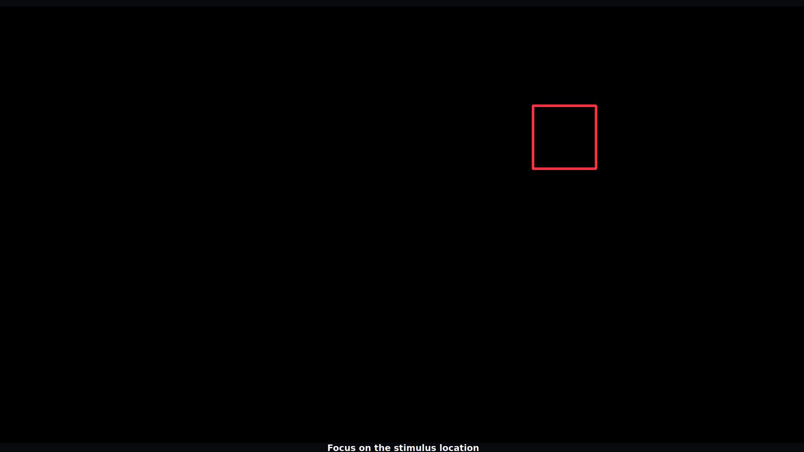
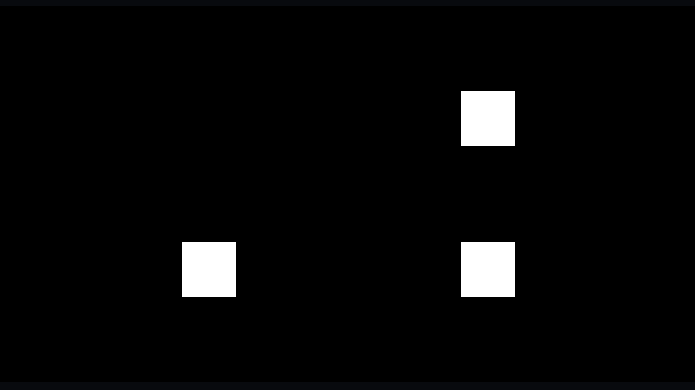
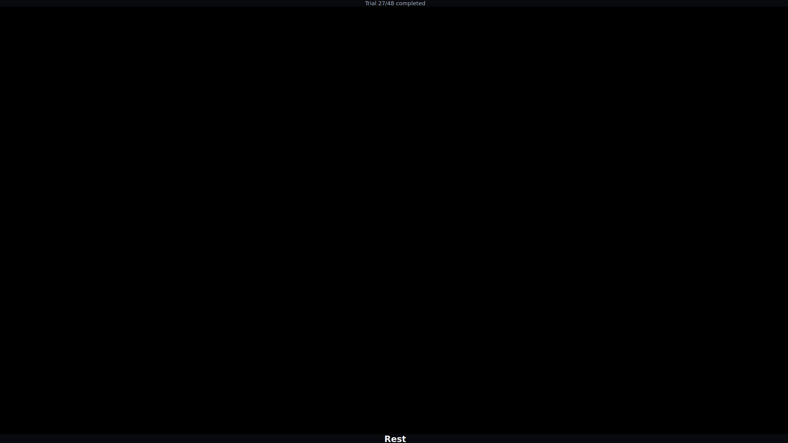
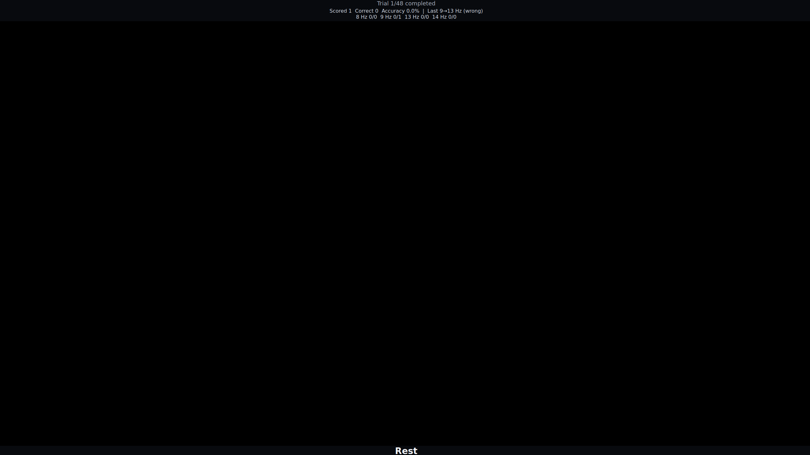
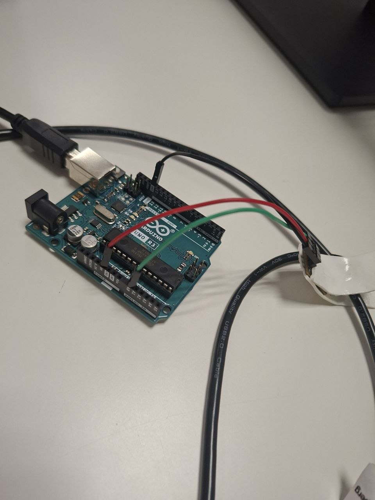
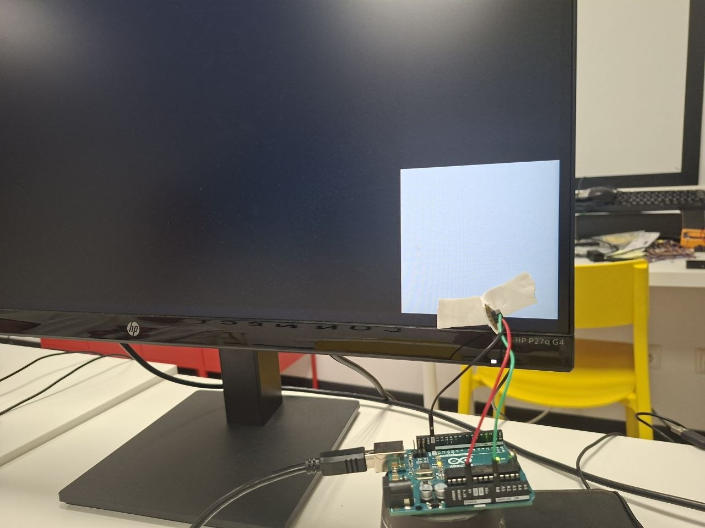

# SSVEP experiment

## Description

This document describes how to set up and run the steady-state visual evoked
potential (SSVEP) experiment. The experiment presents flickering visual
stimuli at known frequencies while the participant attends to a selected
stimulus. EEG is acquired continuously, and the session records the protocol,
stimulus timing, acquisition status, markers, and raw EEG data for later
analysis. Optional live processing can also be enabled by the selected
configuration.

The SSVEP experiment is used to validate the complete BCI data-collection flow:
stimulus presentation, EEG acquisition, frame-confirmed event timing, session
recording, and (when configured) online processing. The resulting session can
be validated and inspected with the analysis tools described in the SSVEP
project README.

## Prerequisites and installation

The experimenter should be comfortable using a terminal and following setup
instructions. The application is provided by the `ssvep-bci` project and uses
Python 3.11.

The complete installation instructions, virtual-environment setup, supported
platform commands, dependency groups, and launch examples are maintained in
the project README:

[Installation and usage guide for `ssvep-bci`](../ssvep-bci/README.md)

## Experiment setup

### Hardware setup

The experiment uses an OpenBCI Ultracortex Mark IV headset with an OpenBCI
Cyton EEG board. The Cyton BIAS connection is used as ground. Reference and
BIAS connections are not counted as active EEG channels.

| Configuration    | Active EEG positions in this project | Acquisition rate |
| ---------------- | ------------------------------------ | ---------------- |
| Cyton, 8-channel | O1, O2, Oz, PO3, PO4, P3, P4, Pz     | 250 Hz           |

Prepare the headset and electrodes according to the hardware manufacturer's
instructions. Check electrode contact and confirm that the Cyton is the only
FTDI/OpenBCI serial device connected when using the default `serial_port: auto`
configuration. On Ubuntu, the user may also need permission to open the board's
device file; the project README describes the `dialout` setup.

### Software and configuration

Choose a configuration that matches the planned experiment. The
`four-frequency-collection` profile is the basic collection workflow used in
this document. It presents four simultaneous flickering squares at 8.25, 9.75,
12.75, and 14.25 Hz, with a red outline identifying the target the participant
should attend to.

For a real Cyton recording, use a copy of the profile with its
`device_profile` set to the Cyton device profile. Validate the configuration
before connecting the participant:

```bash
ssvep-bci validate --config "./ssvep-bci/src/ssvep_bci/resources/configs/four-frequency-collection.yaml"
```

## Running the four-frequency FBTDCA experiment

The four-frequency FBTDCA workflow has three stages:

1. collect at least two complete labeled training sessions;
2. train and validate a participant-specific FBTDCA model;
3. run a labeled online verification session with that model;

Keep the same participant, ordered frequencies, channel order, sampling rate,
stimulus timing, and notch settings across all sessions used for one model.

### Experiment configuration

The `four-frequency-fbtdca` profile presents four fixed 200×200 pixel squares
at 8, 9, 13, and 14 Hz. All squares are visible at the same time, and a red
outline identifies the square the participant should attend to.

The profile records 12 balanced trials for each frequency. The target order is
deterministic, so the session plan records which frequency was attended on every
trial. Do not change the frequency values or their order between collection,
training, and verification.

Validate the profile before starting a participant session:

```bash
ssvep-bci validate --config four-frequency-fbtdca
```


### Collecting training sessions

Collect at least two separate complete sessions for the same participant. Two
sessions are required for leave-one-session-out validation during model
training:

```bash
ssvep-bci run \
  --config four-frequency-fbtdca \
  --participant P012 \
  --session-label fbtdca-run-1

ssvep-bci run \
  --config four-frequency-fbtdca \
  --participant P012 \
  --session-label fbtdca-run-2
```

Use a new session label for each run. Before each session, confirm the
participant ID, Cyton connection, electrode contact, and selected profile.
During the experiment, the participant attends to the red-outlined square while
all four squares flicker. The application continuously acquires EEG and saves
frame-confirmed stimulus events, protocol events, acquisition health, and raw
EEG samples.





The participant rests during the configured breaks between trials and blocks:



If a session is interrupted or contains acquisition or timing problems, do not
use it as a training session. Validate the completed session and resolve any
issues before continuing:

```bash
ssvep-bci validate-session "./ssvep-bci/sessions/<session-folder>"
```

### Training and validating the FBTDCA model

Install the training dependency from the repository's `BCI` directory:

```bash
python -m pip install -e "./ssvep-bci[training]"
```

Open the dedicated notebook:

```bash
jupyter lab "./ssvep-bci/notebooks/four_frequency_fbtdca.ipynb"
```

Set `PARTICIPANT_ID` to the participant used for both collection sessions,
then run all notebook cells. The notebook reads the raw session CSV files and
the frame-confirmed event timestamps. For every trial, it extracts a
3.5-second EEG epoch beginning 0.25 seconds after stimulus onset. It performs
leave-one-session-out validation and writes the participant-specific model and
summary below:

```text
ssvep-bci/models/<participant>/
```

Review the validation summary before using the model for online verification.
The model is only compatible with sessions that preserve the same ordered
frequencies, channel order, sampling rate, timing, and notch settings.

### Online verification

Start a labeled verification session with the generated model:

```bash
ssvep-bci verify \
  --config four-frequency-fbtdca \
  --model "./ssvep-bci/models/P012/four_frequency_fbtdca.joblib" \
  --participant P012 \
  --session-label fbtdca-verification
```

Replace `P012` with the participant identifier and use the model path created
by the notebook. The participant follows the same attended-target task as in
the training sessions. The live scorecard is shown between trials and hidden
while the stimuli flicker so it does not distract the participant.



A verification session produces the normal session artifacts plus:

```text
verification-results.jsonl
verification-summary.json
```

The verification summary contains overall and balanced accuracy, the ordered
confusion matrix, per-class performance, processing latency, and model
metadata/hash. Validate the verification session after it finishes and retain
the complete session folder together with the model and both validation
summaries.


## Validating real stimulus frequency with Arduino and a photoresistor

The optional [`ssvep-frequency-test`](../ssvep-frequency-test/PHOTOSENSOR_FREQUENCY_CHECK.md)
utility measures the actual frequency displayed by the monitor. Use it before
an experiment when you have an Arduino and a photoresistor, especially after
changing the monitor, display settings, resolution, refresh rate, or stimulus
configuration.

The recorder and the SSVEP application must run on the same computer. The
Arduino's device clock is used to measure sample spacing, while host monotonic
timestamps align the photoresistor recording with the saved SSVEP session.

### Prepare the Arduino sensor

Install the utility and upload
[`arduino_light_sensor_sketch.ino`](../ssvep-frequency-test/arduino_light_sensor_sketch/arduino_light_sensor_sketch.ino)
to the Arduino:

```bash
python -m pip install -e "./ssvep-frequency-test"
```

The sketch reads the photoresistor from analog input A0, samples at a fixed
400 Hz cadence, and sends data over serial at 115200 baud. Assemble the
Arduino/photoresistor circuit as shown below:



Fix the photoresistor directly over the SSVEP square being measured. Use opaque
tape or another light-blocking material to shield it from room light, and make
sure it covers only the selected square. The setup should look like this:



The bundled validation profile places one 400×400 pixel square in the
bottom-right corner of the display. Keep the sensor fixed on that square during
the measurement.

### Run the frequency check

The simplest workflow uses the portable coordinator. Open two terminals in the
repository's `BCI` directory.

In terminal 1, start the photoresistor recorder. Replace the port with the
Arduino port on your computer:

```bash
ssvep-frequency-validation record --port /dev/ttyACM0
```

On Windows, use a COM port instead:

```powershell
ssvep-frequency-validation record --port COM3
```

In terminal 2, run the SSVEP monitor-validation profile:

```bash
ssvep-frequency-validation run ssvep-bci --participant MONITOR_TEST
```

The default `frequency-validation` profile presents a 12.75 Hz square twice
for ten seconds per trial. Keep the recorder running until the presentation
finishes, then stop terminal 1 with `Ctrl+C`.

Analyze the newest matching recording:

```bash
ssvep-frequency-validation analyze ssvep-bci
```

The coordinator creates a timestamped measurement under
`./measurements`, saves the SSVEP session under `./ssvep-bci/sessions`, and
writes the analysis into the session's `photosensor-check` directory. If the
coordinator command is not available, use the equivalent commands documented
in the [photosensor frequency-check guide](../ssvep-frequency-test/PHOTOSENSOR_FREQUENCY_CHECK.md).

### Check the result

Inspect `photosensor-check/summary.csv`, `time_domain.png`, and
`fft_classes.png`. The summary reports the target frequency, detected
frequency, frequency error, PASS/FAIL result, signal range, sample count,
duration, estimated frame skips, and harmonic checks. The default acceptance
tolerance is 0.25 Hz.

A passing frequency result confirms that the displayed stimulus is measured
near its configured frequency. Also inspect the time-domain report for
irregular transitions or frame skips: frequency identity and frame timing are
separate checks. If the sensor is saturated, has low contrast, or detects room
light, improve the sensor shielding and placement and repeat the measurement.
