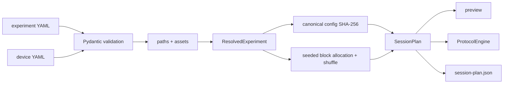

# Configuration and Deterministic Planning

## Why configuration and planning are separate

Configuration describes experimental intent: profile, stimuli, repetitions,
durations, presentation, marker catalog, device profile, QC settings, and
output location. A `SessionPlan` describes one exact execution: ordered rests,
practice/experiment blocks, breaks, trials, phase steps, durations, and stable
identifiers.

Compiling intent before runtime provides two useful guarantees:

- the complete experiment can be previewed and checked without connecting a
  device; and
- randomization cannot change partway through a recording due to UI or timing
  behavior.

## Schema model

All schemas inherit `StrictModel`, which sets Pydantic to reject unknown fields
and prevent model attribute reassignment. This catches misspelled YAML keys and
discourages runtime mutation. Models carry `schema_version: 1` at the top-level
experiment/device/session contracts.

`ExperimentConfig` groups:

- identity: `experiment_id`, title, schema version;
- protocol: an explicit ordered phase sequence, random seed, block/repetition
  design, practice, rests, and breaks;
- phase definitions: positive duration and instruction for each phase used by
  the protocol sequence;
- stimuli: stable ID, display label, and optional image/audio paths;
- presentation: subject-window mode/display selection, countdown/progress,
  audio;
- markers: fixed semantic event codes plus a contiguous stimulus code base;
- QC configuration: currently persisted but not executed;
- output root and a path to the separate device profile.

`DeviceProfile` groups acquisition concerns:

- backend kind (`synthetic`, `brainflow_synthetic`, `replay`, `cyton`, or
  `lsl`);
- expected sample rate and channel-to-label/position mapping;
- board ID where applicable;
- reference, ground, connection parameters, and pre/post roll.

Keeping device details separate lets the same protocol run against synthetic,
replay, LSL, or eventual Cyton input without editing trial design.

### Subject window mode

`presentation.window_mode` is a strict enum that determines how the subject
window opens on its selected display:

| Value | Opening behavior |
|---|---|
| `FULL_SCREEN` | Ignore saved placement and fill the selected display |
| `PREVIOUS_POSITION` | Restore that display's saved geometry and normal/maximized/full-screen state; otherwise center |
| `TOP_LEFT` | Ignore saved placement and open a bounded 1024x720 window at the available top-left |
| `CENTER` | Ignore saved placement and open a bounded 1024x720 centered window |

Every close still captures the current placement, regardless of opening mode.
The obsolete `full_screen` boolean is not accepted: strict validation requires
all configurations to use `window_mode`.

## Cross-field validation

Validation checks more than individual value types:

- stimulus and device channel IDs/labels must be unique;
- practice stimulus IDs must exist and practice stimuli/repetition count must
  be enabled together;
- the phase mapping must exactly match the phases named by `protocol.sequence`;
- recorded trials must divide evenly across blocks;
- marker codes must be positive and fixed codes must not collide;
- generated stimulus marker codes must not overlap fixed event codes;
- BrainFlow-style backends require a board ID;
- LSL requires at least a stream name or stream type;
- configured assets must exist when their presentation settings require them.

The bundled configurations currently use:

| Profile | Sequence |
|---|---|
| `imagined_only` | REST → STIMULUS → THINKING → PAUSE |
| `heard_imagined_spoken` | FIXATION → STIMULUS → FIXATION → THINKING → FIXATION → SPEAKING → REST → POST-TRIAL |

Phase order is declared directly in `protocol.sequence`. A phase may appear
more than once; the compiler gives each occurrence a unique step ID. The
runtime executes the persisted sequence and the UI does not reorder it.

## Path resolution

Every relative path is resolved relative to the YAML file that declares it:

- `device_profile` and stimulus assets are relative to the experiment YAML;
- `output.root_dir` is relative to the experiment YAML;
- the BrainFlow replay `connection.file` is relative to the device-profile
  YAML.

`load_experiment` returns `ResolvedExperiment`, retaining both validated models,
their absolute source paths, and absolute stimulus asset paths. This avoids
behavior changing with the process working directory.

## Plan compilation

`compile_session_plan` performs the following deterministic transformation:

1. Serialize `ExperimentConfig` canonically (sorted JSON keys, compact
   separators, UTF-8) and compute SHA-256.
2. Derive `plan_id` from the first 16 hex characters of that fingerprint.
3. Add optional initial rest.
4. Expand and independently shuffle practice stimuli with a seed namespace of
   `<seed>:practice`.
5. Allocate every stimulus repetition across experiment blocks. Base
   repetitions go to every block; any remainder is rotated across blocks from
   a seed-derived starting position.
6. Shuffle each block with its own `<seed>:block:<number>` namespace.
7. Create stable block, trial, and phase-step IDs and copy display labels,
   instructions, and durations into the plan.
8. Insert configured inter-block breaks and optional final rest.

Separate seed namespaces mean changing practice contents does not consume the
same pseudo-random stream as an experiment block. Identical validated
configuration and seed produce identical plan JSON.

## Balance and numbering

Experiment trial numbers are global across experiment blocks. Practice uses a
separate block with number `0` and practice trial numbering. Within each block,
`block_trial_number` begins at one. The plan exposes derived counts and total
duration for preview and validation.

The compiler balances repetitions over blocks but does not implement more
advanced constraints such as “no adjacent identical stimulus” or phonetic
category counterbalancing. Such requirements belong in a future plan compiler
version and must be visible in the persisted plan.

## Reproducibility boundary and limitations

The configuration fingerprint covers the parsed `ExperimentConfig`, including
the textual device-profile path, but not the contents of the referenced device
file or stimulus asset bytes. The session package separately snapshots the
resolved device profile. Consequently:

- trial ordering and plan identity are reproducible from the experiment
  configuration;
- the session snapshot records which device settings were actually used;
- changing a device YAML in place does not change `plan_id`;
- asset files are referenced/validated but are not copied or hashed into the
  current session package.

Also, Pydantic's frozen model prevents assigning model attributes, but nested
mapping objects such as marker dictionaries are not deeply immutable Python
containers. Runtime modules treat all resolved configuration and plan objects
as read-only; future schema hardening could replace nested dictionaries with
immutable mappings.

## Bundled profiles

The package includes a short four-phoneme Cyton design with five-repeat audio
stimuli, plus short
smoke configurations for native synthetic, BrainFlow synthetic, and LSL paths.
Device profiles cover native deterministic synthetic, BrainFlow synthetic,
BrainFlow replay, Cyton, and LSL. The native synthetic smoke profile is the CLI
default so validation and a complete virtual recording work without hardware
or a second process.
