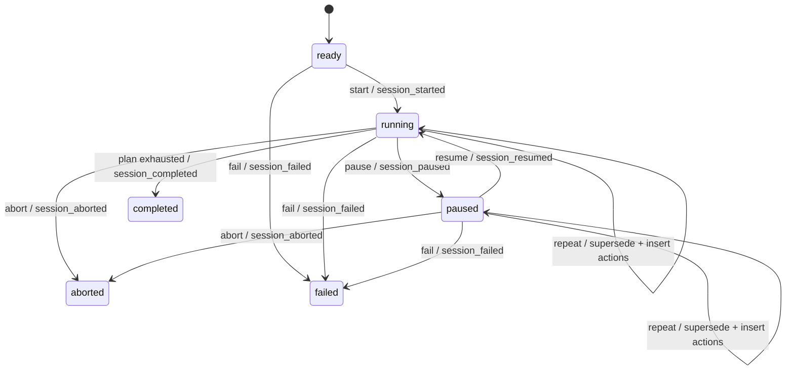

# Protocol Engine, Events, and Subject UI

## Engine model

`ProtocolEngine` is a clock-driven finite-state machine. Its public run states
are `ready`, `running`, `paused`, `completed`, `aborted`, and `failed`.
Completed, aborted, and failed are terminal.

At construction, `build_runtime_actions` flattens the hierarchical
`SessionPlan` into two internal action types:

- `_EventAction` emits an instantaneous semantic boundary such as block start,
  phase end, or stimulus presentation;
- `_TimedAction` owns a screen, duration, and contextual identifiers.

Flattening makes transition order explicit. The engine advances through any
number of instantaneous actions until it reaches a timed action, sets a
deadline, and waits for a runner to call `tick()` after that deadline.

Invalid transitions raise `RuntimeError`; they are not silently ignored. Pause
stores the current remaining duration, and resume creates a new deadline from
the resume time. Acquisition is not owned by the engine and therefore is not
paused.

Trial and block recovery changes only the engine's future action list. The
active phase/trial is closed with a superseded outcome, an explicit repeat
event is emitted, and fresh actions are built from the immutable persisted
plan with incremented attempts. When issued while paused, the replacement
attempt is prepared but remains paused until resume. Abort similarly emits
closing phase/trial/block or rest/break boundaries before its terminal event.

## Clock abstraction and drift control

The engine depends on `ProtocolClock`, which exposes only monotonic seconds and
UTC wall time.

- `RealClock` uses `time.monotonic()` for durations and timezone-aware UTC for
  human/audit timestamps.
- `VirtualClock` advances only when a runner requests it and derives UTC from a
  fixed origin.

Durations never depend on wall-clock time, which can jump due to synchronization
or system changes. When a real runner notices a deadline late, the engine
anchors the next timed action to the preceding deadline rather than “now.”
This prevents polling latency from accumulating across the plan, although
emitted timestamps still describe the actual call time.

Virtual time gives deterministic, fast tests and smoke sessions. It is limited
to the in-process synthetic backend because real LSL and hardware producers
continue on wall time.

## Event contract

Every semantic transition becomes a `ProtocolEvent` containing:

- schema and strictly increasing sequence number;
- event type, event source, and positive numeric marker code;
- monotonic and UTC timestamps;
- session and plan identity;
- optional block, trial, attempt, phase, stimulus, and step context;
- an extensible payload for scope or failure reason.

The source distinguishes engine-generated boundaries, system lifecycle events,
operator commands, experimenter/subject UI actions, and system actions. Current
event types cover session, rest, block, break, trial, phase, stimulus
presentation, pause/resume, trial/block repeats, refit notes, abort, and
failure.

The engine owns marker mapping. Fixed lifecycle/boundary codes come from
`MarkerConfig`; phase start/end codes are keyed by phase; stimulus presentation
uses `stimulus_base + index in configured stimuli`. This keeps display labels
out of hardware marker encoding while retaining their meaning in the event.

## Event sinks and authority

`EventSink` is deliberately tiny: `emit(event)`. Implementations include:

- `NullEventSink` for runs where events are intentionally ignored;
- `MemoryEventSink` for tests;
- `CompositeEventSink` for ordered synchronous fan-out;
- `SessionWriter` for the authoritative event log;
- `AcquisitionRecorder` for marker insertion and marker-sidecar records.

The runtime composes `CompositeEventSink(acquisition, writer)`. The same event
object therefore reaches synchronization and persistence without those modules
importing one another. `events.jsonl` remains authoritative because every
backend can preserve it, while LSL inlets cannot inject markers upstream and
device insertion may fail or be quantized to a sample.

## `ViewState`: the engine/UI boundary

The UI does not inspect internal action lists or deadlines. `view_state()`
returns a presentation-safe immutable snapshot:

- run state and screen name;
- headline and instruction;
- current stimulus identity/label;
- remaining and total duration;
- practice/experiment block and trial progress.

Paused and terminal states deliberately replace stimulus content with neutral
messages. This boundary prevents experimenter diagnostics from leaking into the
subject display and lets a future UI implementation render the same engine.

## Headless runners

`simulation.py` contains two minimal drivers:

- `run_virtual` starts the engine, jumps the virtual clock by exactly the
  remaining time, and ticks until terminal;
- `run_real` starts the engine and polls at up to 20 ms intervals, sleeping no
  longer than the current remaining duration.

The runners decide when time advances and `tick` is called; they do not decide
what the next phase is.

## Subject UI

`SubjectWindow` is a Qt widget that receives only the engine and
`ResolvedExperiment`:

1. In subject-only mode it starts the engine once its labels, multimedia
   objects, and timer exist. In the experimenter workflow it is passive and
   waits for `SessionRuntime` to start the engine after pre-roll.
2. A 50 ms timer drives real-time subject-only runs. In virtual UI mode, each timer callback
   jumps to the current action boundary for fast visual development.
3. `_render` requests a fresh `ViewState` and updates headline, instruction,
   optional countdown, and progress.
4. Media changes only when `step_id` changes. During a stimulus step, the UI
   resolves the prevalidated image/audio paths, scales images while preserving
   aspect ratio, and optionally plays audio.
5. A terminal state stops the timer and closes after a short final message.
6. Escape or window close aborts an active/paused engine with source
   `subject_ui`; it does not simply terminate the application and lose the
   semantic event.

`run_subject_window` validates the selected display index and applies the same
`FULL_SCREEN`, `PREVIOUS_POSITION`, `TOP_LEFT`, or `CENTER` placement policy as
the experimenter workflow. `--windowed` explicitly selects `CENTER`. Geometry
is display-relative, clamped to the available area, and persisted when the
window closes. The Qt event loop is still the UI thread, while acquisition
reads and raw disk writes remain off that thread.

## Current limitations and extension points

- The subject UI intentionally exposes only safe abort. Experimenter pause,
  resume, repeat, refit, and abort controls live in a separate window.
- Repeat is scoped to the currently active block trial; repeating the previous
  block after its `block_ended` event is not yet supported.
- Event fan-out is synchronous. Expensive future consumers must use their own
  queues so they cannot delay engine transitions.
- The engine is not a general arbitrary workflow interpreter; it executes the
  two validated protocol profiles and compiled plan item types.
- Multimedia load/playback errors are not yet emitted as structured health
  events.
