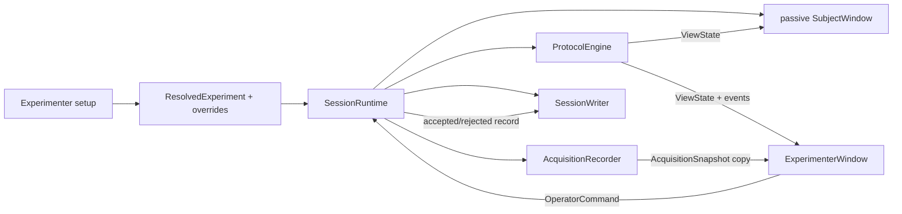
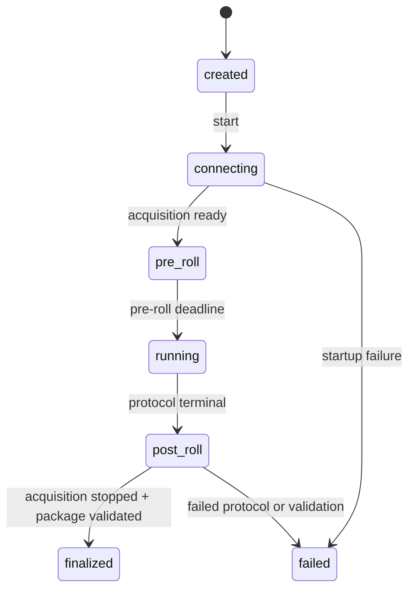

# Experimenter Workflow and Recovery

## Role in the architecture

Milestone 4 adds two modules above the existing engine/acquisition/persistence
contracts:

- `SessionRuntime` owns one live session's object graph and lifecycle;
- `ExperimenterWindow` gathers setup choices, polls the runtime for monitoring,
  issues typed commands, and manages the separate subject window.

The experimenter UI does not read or modify `eeg_raw.csv`, does not schedule
protocol phases, and does not send diagnostics to the subject window. It uses
copies exposed by the runtime while acquisition and persistence remain
authoritative.

## Setup page

The setup page makes run-time choices without editing source code:

- participant ID and optional researcher session label;
- experiment/protocol YAML and device-profile YAML;
- random seed override;
- output directory;
- experimenter and subject displays;
- resolved montage, reference, and ground;
- explicit audio-readiness confirmation when audio is enabled.

Loading configuration uses the same strict loader as headless commands. Device
and seed overrides are revalidated into a new `ExperimentConfig` and
`ResolvedExperiment`, so planning and snapshots see the selected values.
Preview shows protocol, duration, block/trial balance, device, montage, phases,
assets, and selected seed. Warnings call out a single/same display, unconfirmed
audio, LSL producer requirements, and Cyton hardware requirements.

The generated UUID remains the globally unique session ID. The optional
session label is a human-facing identifier persisted in the manifest and
included in the directory name.

## Runtime lifecycle

`SessionRuntime` creates the plan, writer, backend, recorder, engine, and event
fan-out for exactly one session. Its application-level state is separate from
the protocol state:

During pre-roll, the subject display shows `READY`; the engine does not emit
`session_started` until the configured acquisition lead-in has elapsed. During
post-roll, the engine is terminal while acquisition continues. Finalization
then stops/drains acquisition, registers its artifacts, writes checksums, and
immediately validates the package.

Closing the experimenter application during an active session records an abort
command and finalizes available data. A hard process kill remains outside this
controlled path and can leave an `in_progress` package.

## Two-display ownership

Device preparation runs on a bounded connection worker so the experimenter
window can display `connecting` instead of freezing during LSL/Cyton discovery.
Closing is temporarily guarded while that worker owns startup state.

The experimenter application creates `SubjectWindow` with `auto_start=False`
and `drive_engine=False`. The runtime/experimenter timer owns engine ticks; the
subject timer only renders fresh `ViewState`. This removes the possibility of
two GUI timers advancing the same protocol.

The subject window receives only the engine presentation model and resolved
stimulus assets. It has no reference to acquisition snapshots, marker tables,
storage health, operator command records, or experimenter controls. Escape or
closing that display remains a subject-sourced controlled abort.

## Live monitoring data flow

Every 50 ms the experimenter page refreshes from non-destructive snapshots:

- `engine.view_state()` supplies protocol/phase/progress/countdown;
- the in-memory event sink supplies recent marker sequence/type/code/time;
- `AcquisitionRecorder.snapshot()` supplies counters, health, channel catalog,
  and a bounded copy of recent raw source rows;
- filesystem metadata supplies current raw-file size and free output storage;
- the runtime supplies connection/recording/finalization state and command
  results.

`EEGTraceWidget` is a Qt painter implementation with no additional plotting
dependency. Backend metadata maps configured EEG labels to source-row indexes;
BrainFlow traces therefore ignore auxiliary board rows while those rows remain
in the raw recording. Per-channel status is intentionally limited to
`receiving`, `flat`, or `no data` based on the displayed copy. It is operational
reception feedback, not Milestone 5 signal-quality classification.

## Command contract and audit

The UI sends `OperatorCommand` values to `SessionRuntime.execute`. The runtime
captures context/state, attempts the engine operation, and writes an
`OperatorCommandRecord` whether it succeeds or is rejected.

| Command | Accepted when | Effect |
|---|---|---|
| Pause | Running timed action | Freezes remaining protocol duration; acquisition continues |
| Resume | Paused timed action | Rebuilds deadline from stored remaining duration |
| Repeat trial | Running/paused inside a trial | Closes current attempt as superseded and inserts the same trial with incremented attempt |
| Repeat block | Running/paused inside a block trial | Supersedes the current/previous partial pass and inserts the block's trials again |
| Refit | Running or paused, with a non-empty note | Pauses if necessary and emits a refit event; acquisition continues |
| Abort | Running or paused | Closes active phase/trial/block or rest/break scopes, then emits terminal abort |

Each record includes command sequence, accepted/rejected status, source,
monotonic/UTC timestamps, note, reason, state before/after, session/block/trial
context, and runtime state. Protocol events caused by accepted commands remain
in `events.jsonl`; command audit records and legacy action-event copies are in
`operator-actions.jsonl`.

## Repeat and supersession semantics

Recovery changes future execution without mutating history:

1. If a phase is active, emit `phase_ended` with `outcome: superseded`.
2. Emit `trial_ended` with the same outcome.
3. Emit `trial_repeated` or `block_repeated` with prior/new attempt metadata.
4. Insert new runtime actions built from the persisted plan.
5. Start the new attempt at its first phase, or keep it ready-but-paused if the
   command was issued while paused.

Block repeat resets validation's expected trial position and identifies the
latest prior attempts as superseded. Trials never previously reached retain
attempt 1; trials already attempted increment. A completed package is valid
only when the final non-superseded pass completes every planned trial/phase.

## Final summary

After controlled finalization, the experimenter can export a JSON summary with
session/participant/experiment/device identity, status, event/command/trial/
phase/sample counts, warnings, and package path. It explicitly reports that QC
is unavailable until Milestone 5 rather than presenting reception status as a
QC result.

## Current limitations

- The bounded connection worker cannot be cancelled midway; close/retry becomes
  available after the backend's configured connection timeout.
- Repeat is available only while a block trial is current, not after leaving
  the block for a break.
- Reception status does not detect amplitude, line noise, impedance, drift, or
  artifacts; those belong to the asynchronous QC milestone.
- Session setup supports one subject and one experimenter window in the same
  process; remote/networked operator clients are not implemented.
