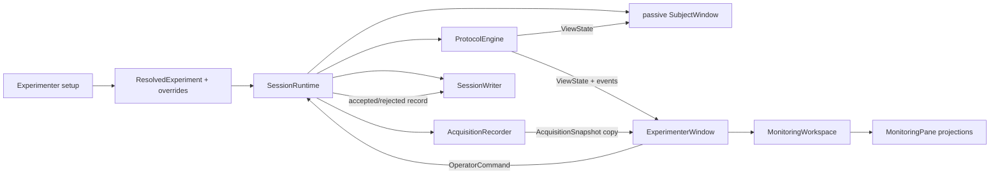
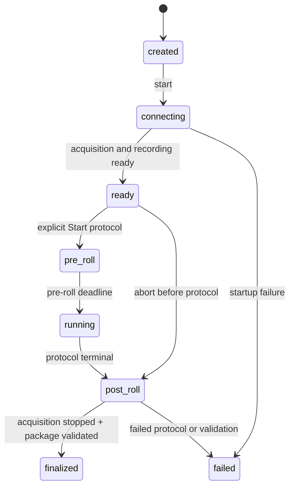

# Experimenter Workflow and Recovery

## Role in the architecture

Milestone 4 and its desktop follow-up add five modules above the existing
engine/acquisition/persistence contracts:

- `SessionRuntime` owns one live session's object graph and lifecycle;
- `ExperimenterWindow` gathers setup choices, polls the runtime for monitoring,
  issues typed commands, and manages the separate subject window.
- `ExperimenterSettingsStore` persists non-scientific per-user preferences;
- `MonitoringWorkspace` owns the active nested-splitter tree;
- `MonitoringPanelRegistry` and the monitoring-view widgets provide pane-local,
  read-only projections of session state.

The experimenter UI does not read or modify `eeg_raw.csv`, does not schedule
protocol phases, and does not send diagnostics to the subject window. It uses
copies exposed by the runtime while acquisition and persistence remain
authoritative.

## Setup page

The setup page makes run-time choices without editing source code:

- participant ID and optional researcher session label;
- experiment/protocol YAML and device-profile YAML;
- random seed override;
- output directory;
- subject display (the experimenter window retains its current desktop
  placement);
- resolved montage, reference, and ground;
- explicit audio-readiness confirmation when audio is enabled.

Loading configuration uses the same strict loader as headless commands. Device
and seed overrides are revalidated into a new `ExperimentConfig` and
`ResolvedExperiment`, so planning and snapshots see the selected values.
Preview shows protocol, duration, block/trial balance, device, montage, phases,
assets, and selected seed. Warnings call out a single display, unconfirmed
audio, LSL producer requirements, and Cyton hardware requirements.

The generated UUID remains the globally unique session ID. The optional
session label is a human-facing identifier persisted in the manifest and
included in the directory name.

## Runtime lifecycle

`SessionRuntime` creates the plan, writer, backend, recorder, engine, and event
fan-out for exactly one session. Its application-level state is separate from
the protocol state:

After connection, acquisition and raw writing are active but the runtime stays
in `READY` indefinitely. The subject window is created on the UI thread only
after connection succeeds and renders a passive preparation screen. The
audited, at-most-once Start protocol command begins configured pre-roll; the
engine emits `session_started` only after that lead-in. Abort in `READY`
produces a valid package whose terminal event records that the protocol did not
start. During post-roll, acquisition continues until finalization stops and
drains it, registers artifacts, writes checksums, and validates the package.

Closing the experimenter application during an active session records an abort
command and finalizes available data. A hard process kill remains outside this
controlled path and can leave an `in_progress` package.

## Two-display ownership

Device preparation runs on a bounded connection worker so the experimenter
window can display `connecting` instead of freezing during LSL/Cyton discovery.
Closing is temporarily guarded while that worker owns startup state.

After source connection succeeds, the experimenter application creates
`SubjectWindow` with `auto_start=False`
and `drive_engine=False`. The runtime/experimenter timer owns engine ticks; the
subject timer only renders fresh `ViewState`. This removes the possibility of
two GUI timers advancing the same protocol.

The experimenter shell is the same `QMainWindow` used for setup, live
monitoring, review, and the next session. Opening the subject window never
assigns or moves that shell to another display. Its Qt geometry is restored at
application startup and saved on clean close.

`SubjectWindowPlacementController` assigns the configured subject display and
applies `presentation.window_mode`. Saved normal geometry is relative to that
display's available area and is clamped after resolution or taskbar changes.
For full-screen presentation, both the widget geometry and native window
position are anchored to the selected screen's full geometry before and after
the full-screen transition.
Placements are independent per stable display identity and include normal,
maximized, or full-screen state. Only `PREVIOUS_POSITION` restores them;
missing placement falls back to `CENTER`. All modes capture the latest
placement when the subject window closes.

The subject window receives only the engine presentation model and resolved
stimulus assets. It has no reference to acquisition snapshots, marker tables,
storage health, operator command records, or experimenter controls. Escape or
closing that display remains a subject-sourced controlled abort.

## Live monitoring data flow

Every 50 ms the experimenter page refreshes from non-destructive snapshots:

- `engine.view_state()` supplies protocol/phase/progress/countdown;
- the in-memory event sink supplies recent marker sequence/type/code/time;
- `AcquisitionRecorder.snapshot()` supplies counters, health, channel catalog,
  and a bounded copy of recent raw source rows;
- filesystem metadata supplies current raw-file size and free output storage;
- the runtime supplies connection/recording/finalization state and command
  results.

`EEGTraceView` is a Qt painter implementation with no additional plotting
dependency. Backend metadata maps configured EEG labels to source-row indexes;
BrainFlow traces therefore ignore auxiliary board rows while those rows remain
in the raw recording. Per-channel status is intentionally limited to
`receiving`, `flat`, or `no data` based on the displayed copy. It is operational
reception feedback, not Milestone 5 signal-quality classification.

## Command contract and audit

The UI sends `OperatorCommand` values to `SessionRuntime.execute`. The runtime
captures context/state, attempts the engine operation, and writes an
`OperatorCommandRecord` whether it succeeds or is rejected.

| Command | Accepted when | Effect |
|---|---|---|
| Start protocol | Recording-ready runtime | Begins configured pre-roll exactly once while recording continues |
| Pause | Running timed action | Freezes remaining protocol duration; acquisition continues |
| Resume | Paused timed action | Rebuilds deadline from stored remaining duration |
| Repeat trial | Running/paused inside a trial | Closes current attempt as superseded and inserts the same trial with incremented attempt |
| Repeat block | Running/paused inside a block trial | Supersedes the current/previous partial pass and inserts the block's trials again |
| Refit | Running or paused, with a non-empty note | Pauses if necessary and emits a refit event; acquisition continues |
| Abort | Recording-ready, running, or paused | Closes active scopes when present and emits terminal abort |

Each record includes command sequence, accepted/rejected status, source,
monotonic/UTC timestamps, note, reason, state before/after, session/block/trial
context, and runtime state. Protocol events caused by accepted commands remain
in `events.jsonl`; command audit records and legacy action-event copies are in
`operator-actions.jsonl`.

## Repeat and supersession semantics

Recovery changes future execution without mutating history:

1. If a phase is active, emit `phase_ended` with `outcome: superseded`.
2. Emit `trial_ended` with the same outcome.
3. Emit `trial_repeated` or `block_repeated` with prior/new attempt metadata.
4. Insert new runtime actions built from the persisted plan.
5. Start the new attempt at its first phase, or keep it ready-but-paused if the
   command was issued while paused.

Block repeat resets validation's expected trial position and identifies the
latest prior attempts as superseded. Trials never previously reached retain
attempt 1; trials already attempted increment. A completed package is valid
only when the final non-superseded pass completes every planned trial/phase.

## Reusable desktop lifecycle

The `ExperimenterWindow` is application-scoped; `SessionRuntime`, acquisition,
event memory, and `SubjectWindow` are recording-scoped. The explicit workflow
states `SETUP`, `CONNECTING`, `READY`, `PROTOCOL_ACTIVE`, `FINALIZING`, and
`REVIEW` drive pages and all command availability. Connection results carry a
session generation so an old worker cannot attach to a later recording.

On finalization, the window copies validated scalar results into an immutable
`SessionReviewSummary`, closes the subject window, and releases its runtime
reference. Back to setup clears every active monitoring projection and status
field. The next Start creates a new UUID, directory, writer, engine, backend,
recorder, event memory, and subject window; finalized packages are never
reopened.

## Settings boundary

`ExperimenterSettingsStore` wraps Qt `QSettings` in INI mode. Production uses
the platform's per-user application configuration location and the filename
`experimenter_ui.ini`; tests inject temporary files. Setup, workspace, and
subject placement use independent schema versions, so an invalid future layout
or placement version falls back locally rather than discarding valid experiment
setup.

The setup namespace stores only last-valid participant/session fields,
config/device paths, output root, seed, the subject display identity with index
fallback, and audio readiness bound to its config/device context. Workspace
keys store layout ID, stable pane-slot assignments, and sizes by stable
splitter path. Main-window geometry and versioned per-display subject placements
are separate. Runtime state, commands, samples, secrets, and scientific
artifacts are never preferences. The obsolete `setup/experimenter_screen`
value is ignored for compatibility and removed by **Reset saved setup**.

## Splitter-based monitoring workspace

The header, protocol status, command row, and footer retain their fixed outer
positions. Only the former fixed center grid is replaced by
`MonitoringWorkspace`. Its eight stable layout descriptors build nested
horizontal/vertical `QSplitter` trees corresponding to the layout-picker
icons. Handles resize opaquely, children cannot collapse, and panes have
minimum sizes and equal default stretch.

Each stable pane slot owns a `MonitoringPane` with a local view selector and
content host. `MonitoringPanelRegistry` maps stable view IDs to titles and
factories. Layout switches preserve assignments for hidden slots and remember
splitter sizes per layout. Replaced widgets are disconnected from the tree and
scheduled for deletion; projection widgets own no acquisition timers or
runtime callbacks.

The experimenter refresh loop asks the workspace only for currently assigned
view widgets and supplies immutable/copy data from runtime-owned models. A view
can appear in multiple panes, or in none. Changing layouts or assignments does
not start, stop, read, or mutate acquisition. Registering future QC requires a
new descriptor and factory, not a workspace-layout change.

## Final summary

After controlled finalization, the experimenter can export a JSON summary with
session/participant/experiment/device identity, status, event/command/trial/
phase/sample counts, warnings, and package path. It explicitly reports that QC
is unavailable until Milestone 5 rather than presenting reception status as a
QC result.

## Current limitations

- The bounded connection worker cannot be cancelled midway; close/retry becomes
  available after the backend's configured connection timeout.
- Repeat is available only while a block trial is current, not after leaving
  the block for a break.
- Reception status does not detect amplitude, line noise, impedance, drift, or
  artifacts; those belong to the asynchronous QC milestone.
- Session setup supports one subject and one experimenter window in the same
  process; remote/networked operator clients are not implemented.
