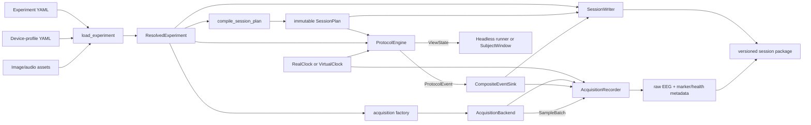
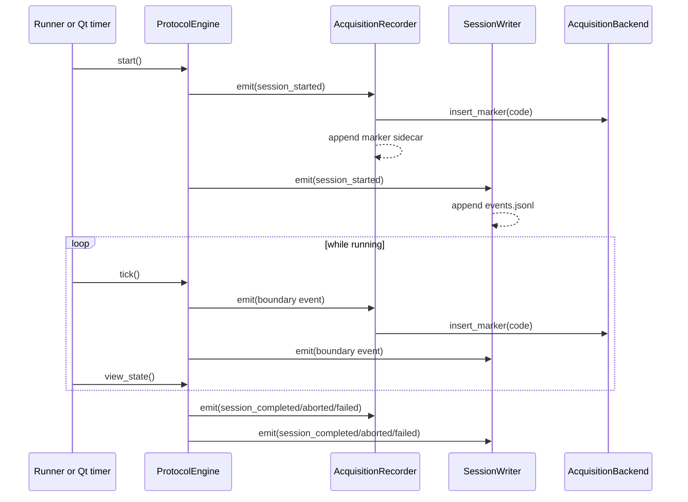
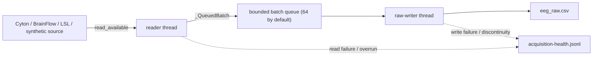

# System Overview and Runtime Data Flow

## Current system boundary

The application is a local Python process with optional external data
producers. The CLI is the composition root: it loads configuration, compiles a
plan, creates the clock and persistence package, selects an acquisition
backend, connects event consumers, and selects either a headless runner or the
subject UI.

The current implementation deliberately has no global service container or
long-lived singleton state. A session is an object graph created for one run
and discarded when the run finalizes.

## Module responsibilities

| Module | Owns | Does not own |
|---|---|---|
| `config` | Input schemas, cross-field validation, device/profile loading, path and asset resolution | Trial ordering, runtime state, hardware connections |
| `plan` | Reproducible trial allocation/order, stable plan/block/trial/phase identifiers | Time, UI, event emission, acquisition |
| `engine` | Protocol state, deadlines, transition order, marker selection, subject-facing view model | Qt widgets, file I/O, EEG reads |
| `events` | Stable event schema and synchronous fan-out boundary | Event scheduling or persistence policy |
| `subject_ui` | Qt presentation, image/audio playback, display selection, user-initiated safe abort | Protocol truth or independent phase timing |
| `simulation` | Driving the engine with real or virtual time without Qt | Protocol decisions |
| `acquisition` backends | Source-specific connection and conversion to `SampleBatch` | Session file format, UI, trial semantics |
| `AcquisitionRecorder` | Continuous reading, queueing, raw CSV writing, marker requests, acquisition health/metadata | Changing EEG values or deciding protocol transitions |
| `SessionWriter` | Session identity, snapshots, event/action logs, artifact registry, manifest and checksums | Hardware reads or protocol scheduling |
| `validate_session` | Integrity and structural checks against the saved plan | Repairing or rewriting a package |
| `cli` | Dependency construction and lifecycle ordering | Scientific behavior hidden outside configuration/modules |

## Startup and composition

For `simulate` and `run`, `_execute_session` performs these operations in
order:

1. `load_experiment` parses and validates the experiment YAML, referenced
   device profile, and enabled assets. Failure here creates no session.
2. `compile_session_plan` turns scientific intent into a fixed execution plan.
3. The CLI chooses `VirtualClock` or `RealClock`. Virtual time is accepted only
   with the in-process synthetic backend.
4. `SessionWriter` creates a unique directory, writes immutable snapshots, and
   marks the manifest `in_progress`.
5. The acquisition factory creates the adapter selected by the resolved device
   profile.
6. `AcquisitionRecorder` is created for that backend and session directory.
7. `ProtocolEngine` is constructed with a `CompositeEventSink` whose consumers
   are the recorder and session writer, in that order.
8. Acquisition is prepared and started, then pre-roll is recorded before the
   engine emits `session_started`.
9. A headless runner or `SubjectWindow` starts and drives the engine.

The explicit construction makes dependencies visible and makes the engine
testable with a memory sink and virtual clock.

## Protocol/event flow

`CompositeEventSink` is synchronous and ordered. An exception from a sink
propagates to the caller; there is no hidden retry or message broker. This is
simple and preserves event order, but it also means sinks on the engine path
must perform little work. The recorder only requests marker insertion and
appends a small JSON line there; raw EEG writing occurs on its worker thread.

## Sample flow and concurrency

With a real clock, source access and disk writing are decoupled:

With `VirtualClock`, there is no background reader: the deterministic
synthetic source is captured explicitly after clock advances and event marker
requests. The raw-writer thread and bounded queue remain in use. This avoids a
real thread attempting to follow a clock that can jump through a full session
in milliseconds.

## Normal shutdown

After engine completion (or UI close), the CLI records post-roll and enters a
`finally` block:

1. The recorder stops its reader, stops the source, performs a final read,
   drains/stops the raw writer, closes the backend, writes acquisition
   metadata, and closes its files.
2. Every acquisition artifact that exists is registered with `SessionWriter`.
3. The engine state is translated to `complete`, `aborted`, `failed`, or
   `incomplete`.
4. The session writer closes event logs, writes the terminal manifest, and
   creates SHA-256 checksums.
5. Successful commands immediately call `validate_session` and report event,
   completed-trial, and sample counts.

## Failure behavior

Failures are converted into data wherever possible:

- Configuration or plan errors happen before a session is opened.
- Acquisition startup failure writes acquisition health/metadata when
  possible, the engine emits `session_failed`, and the package is finalized as
  `failed`.
- Runtime/UI exceptions call `engine.fail(reason)` unless the engine is already
  terminal.
- Reader/writer/stop problems are appended to the health log and reflected in
  acquisition metadata.
- Abort and failure do not delete snapshots, events, or acquired samples.
- Validation permits a partial acquisition artifact set for `failed`,
  `incomplete`, and `in_progress` packages; a `complete` package must contain a
  coherent full set.

This is best-effort finalization, not crash-proof transactional storage. A hard
process kill or power loss can leave an `in_progress` manifest without final
checksums, which the validator reports with the corresponding relaxed policy.

## Implemented and planned boundaries

The current subject UI is the only GUI. The experimenter UI, recovery commands
such as repeat/refit, online QC workers, offline `SessionLoader`, epoching, and
classification modules are roadmap work. The existing typed boundaries are
intended to accept them:

- experimenter controls call engine commands and produce `ProtocolEvent`s;
- QC consumes copies of acquired windows and writes new derivative records;
- offline tools consume the session package rather than internal live objects;
- none of these consumers should rewrite `eeg_raw.csv` or `events.jsonl`.
