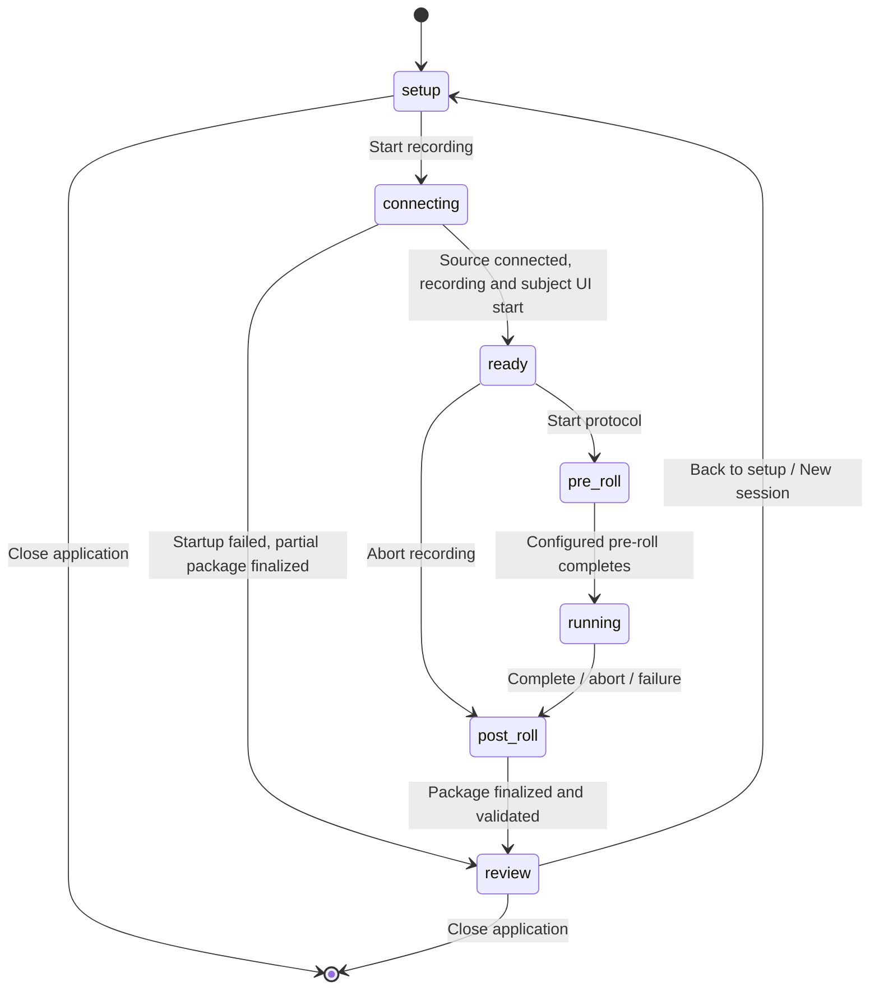

# Experimenter Desktop Follow-Up Roadmap

## Purpose

This sub-roadmap follows Milestone 4 and addresses five desktop-application
usability requirements:

1. connecting a source must start acquisition and recording and display the
   subject window, but the protocol must wait for an explicit **Start
   protocol** action;
2. completed protocols must give every command button, including Abort, a
   clearly disabled appearance;
3. experiment setup must be restored across application launches;
4. a finalized session must return to setup so another recording can be
   started without restarting the application; and
5. the existing experimenter header and controls must remain in their current
   positions, while the center monitoring area becomes a configurable,
   splitter-based multipane workspace based on
   `imagined-speech/multipanelayout/test.py`.

The work preserves the existing scientific invariants: every recording has a
fresh `SessionRuntime`, finalized packages are immutable, recovery never
rewrites raw data or events, and monitoring layout and visibility never affect
acquisition.

**Implementation status:** complete. The lifecycle, settings, centralized
controls, and all eight splitter layouts are implemented and covered by
runtime and offscreen Qt tests. Physical multi-monitor acceptance remains
manual.

## Implementation order

Implement the requirements in this order:

1. **4.1 — Reusable lifecycle and explicit protocol start**
2. **4.2 — Versioned desktop settings**
3. **4.3 — Consistent workflow-driven controls**
4. **4.4 — Splitter-based center monitoring workspace**
5. **4.5 — Integrated desktop acceptance**

The lifecycle comes first because the current window is coupled to one
`SessionRuntime`, and the new recording-ready phase belongs in the same state
model. Settings come next because setup restoration and multipane layout
restoration need one persistence boundary. Centralized control state follows.
The center workspace is then replaced without moving or restructuring the
already established header and controls.

## Target application lifecycle

Separate long-lived application state from short-lived recording state:

- `ExperimenterWindow` and its settings store live for the application launch;
- setup form values and center-workspace preferences belong to the application;
- `SessionRuntime`, `SubjectWindow`, live event/action rows, acquisition
  snapshots, and recording health belong to one recording;
- every new recording creates a new UUID, writer, engine, backend, recorder,
  event memory, and subject window.

The `ready` state is intentionally open-ended. Acquisition and raw writing are
already active, and the subject window is already visible. The experimenter can
move it to the participant display, maximize it, verify presentation, and
settle the participant before starting the protocol. No protocol actions or
trial markers are emitted until **Start protocol** is pressed. Pressing it once
begins the configured pre-roll and then the protocol; it cannot be invoked a
second time for the same recording.

The `review` state retains final status, package path, validation counts, and
summary export until the researcher explicitly returns to setup.

## 4.1 — Reusable lifecycle and explicit protocol start

### Goal

Run two or more independent recordings from one experimenter application
process, and separate starting a recording from starting its protocol.

### Implementation

- Introduce an explicit workflow state such as `SETUP`, `CONNECTING`, `READY`,
  `PROTOCOL_ACTIVE`, `FINALIZING`, and `REVIEW`. Do not infer workflow only from
  scattered widget flags.
- Change **Start recording** so it connects the selected source, creates the
  session package and recorder, starts acquisition and raw writing, opens the
  subject window, and enters `READY`. It must not start the protocol engine.
- Add a prominent **Start protocol** button. Enable it only in `READY`, after
  both source connection and recording startup succeed. Its first accepted
  activation begins the configured pre-roll and protocol and disables it for
  the remainder of that recording.
- Keep the subject UI passive in `READY`. It presents a neutral preparation
  screen without advancing protocol actions, while remaining independently
  movable, resizable, and maximizable.
- Record throughout the `READY` interval. Samples collected while arranging
  the subject UI or settling the participant remain in the append-only raw
  recording; protocol-relative events begin only after explicit protocol
  start.
- Permit Abort in `READY`. Finalize a valid package that makes clear the
  protocol was never started.
- Enforce at-most-once protocol start in `SessionRuntime`, not only by disabling
  the UI button. Reject duplicate clicks and stale callbacks safely.
- Add **Back to setup / New session** in `REVIEW`, including after controlled
  abort or a finalized startup failure.
- Move per-session UI setup into a repeatable initialization path:
  - clear markers, channels, commands, traces, health, and status displays;
  - reset event and command render cursors;
  - create the new runtime and subject window;
  - connect refresh work only to the new runtime.
- Add symmetric teardown:
  - require or perform controlled finalization before leaving the live page;
  - close and release the subject window;
  - finish the bounded connection worker;
  - disconnect old callbacks and release runtime/acquisition references;
  - retain only an immutable final summary in review.
- Preserve setup fields in memory when returning to setup, while allowing the
  researcher to edit all values before the next recording.
- Guard against duplicate recording starts, returning during finalization, and
  late completion callbacks from an earlier connection worker.
- Never reopen or append to a previous session directory.

### Acceptance criteria

- After a synthetic source connects, samples accumulate and the subject window
  can be positioned or maximized while the protocol remains unstarted.
- Start protocol begins the configured pre-roll and first protocol action only
  when pressed; a second activation has no effect.
- Aborting from `READY` creates a valid finalized package with no trial
  sequence and an explicit not-started/aborted outcome.
- Complete a synthetic session, return to setup, modify participant/session
  identity or seed, and complete a second session without restarting the app.
- Both recordings have distinct UUIDs and directories and independently pass
  `validate-session`.
- No previous subject window, rows, traces, commands, snapshots, or callbacks
  appear in a new recording.
- Automated tests cover sequential synthetic runtimes and an offscreen Qt
  `setup → connecting → ready → protocol → review → setup` cycle.

## 4.2 — Versioned desktop settings

### Goal

Restore the researcher’s last valid setup and desktop preferences on the next
application launch.

### Storage decision

Introduce an injectable `ExperimenterSettingsStore`. Use `QSettings` in INI
format in production and a temporary or in-memory implementation in tests. Name
the file `experimenter_ui.ini` and place it under Qt’s per-user application
configuration location (`QStandardPaths`).

Do not write preferences under `imagined_speech/resources`: installed resources
may be read-only, are shared application defaults rather than user state, and
generated preferences should not dirty the source checkout. Bundled YAML files
remain immutable defaults.

### Persisted setup keys

Use namespaced, versioned values rather than serializing widgets directly:

| Key | Meaning |
|---|---|
| `schema/version` | Settings schema version |
| `setup/participant_id` | Last participant ID |
| `setup/session_label` | Last session label/default |
| `setup/config_path` | Last experiment/protocol YAML |
| `setup/device_path` | Last device/montage profile YAML |
| `setup/output_root` | Last session output directory |
| `setup/random_seed` | Last selected seed |
| `setup/experimenter_screen` | Stable display identity with index fallback |
| `setup/subject_screen` | Stable display identity with index fallback |
| `setup/audio_ready` | Last audio-readiness confirmation |
| `setup/audio_context` | Config/device identity for that confirmation |

Audio readiness is restored only when its experiment/device context still
matches. Changing protocol or device invalidates the saved confirmation.

Section 4.4 adds namespaced `workspace/*` values for the center layout. Setup
and workspace schemas are versioned separately so a layout migration cannot
discard valid experiment setup.

### Loading and saving rules

- Load settings before the first configuration preview.
- Revalidate paths and values through the existing configuration loader.
  Missing or moved files produce an actionable warning and safe fallback rather
  than preventing application startup.
- Save the last valid setup when recording starts and on clean application
  close. Do not replace it with partially entered invalid values.
- Never persist connection secrets, runtime objects, raw samples, command
  history, active-session state, or scientific data beyond the requested ID
  fields.
- Make the store injectable so tests never touch the real OS user profile.
- Ignore unknown future schema versions with a warning; migrate known older
  versions or reset them field by field.
- Provide **Reset saved setup** without deleting recorded sessions.

### Acceptance criteria

- Change all setup fields, close, reopen, and observe the last valid values.
- Invalid config/device paths fall back with an actionable warning.
- Changing config/device clears restored audio readiness.
- Screen restoration uses display identity when indexes change and otherwise
  falls back to an available display.
- Tests cover round-trip, missing/corrupt values, version mismatch, migration,
  reset, and isolation from real user settings.

## 4.3 — Consistent workflow-driven controls

### Goal

Make command availability and appearance derive from one workflow policy,
including a clearly disabled Abort button after completion.

### Implementation

- Replace ad-hoc `setEnabled` calls with one policy that maps workflow state,
  engine state, and active-trial context to every command.
- Treat **Start protocol** as state-controlled: enabled only in `READY` and
  disabled while connecting, after its first activation, and in all terminal
  and review states.
- In `READY`, enable Start protocol and Abort but keep Pause, Resume, Repeat,
  and Refit unavailable because there is no active protocol.
- Define shared enabled/disabled styles. Abort may be red while enabled, but
  `QPushButton:disabled` uses the same neutral disabled palette and cursor
  treatment as other controls.
- Do not rely on color alone. Disabled controls use Qt disabled semantics and
  accessible text/tooltips explaining their availability.
- In `REVIEW`, disable Start protocol and all protocol commands; enable only New
  session, Export summary, and application-level actions.
- Ensure shortcuts and focus cannot invoke disabled actions and finalization
  cannot be interrupted by controls that merely look enabled.

### Acceptance criteria

- Completion, abort, and failure disable Start protocol and all existing
  protocol commands with consistent terminal-state appearance.
- Abort has no persistent red background while disabled.
- Enablement tests cover setup, connecting, recording-ready, running in a trial,
  running in rest/break, paused, post-roll, finalized, and failed states.
- Keyboard shortcuts cannot activate a disabled command.

## 4.4 — Splitter-based center monitoring workspace

### Goal

Keep the current experimenter header and control groups in their existing
positions while replacing only the current center monitoring area with a
configurable multipane workspace modeled on
`imagined-speech/multipanelayout/test.py`.

The researcher can choose a pane arrangement, resize it with splitter handles,
and choose which monitoring view appears in each pane. The model must allow
future QC views to be registered without redesigning the window.

### UI decision

Use nested `QSplitter` widgets inside the current center container. Do not
convert the experimenter window to a dock-widget interface, and do not make
monitoring views floating application windows.

Preserve these outer-layout contracts:

- the existing session/protocol header stays where it is;
- the existing status and command controls stay where they are;
- Start recording, Start protocol, Abort, and recovery controls do not move as
  a consequence of selecting a monitoring layout;
- only the widget currently occupying the center dashboard region is replaced;
- center layout changes never cause setup/live/review page changes.

Support the eight layouts demonstrated by the prototype:

1. single pane;
2. four-pane grid;
3. two columns;
4. two rows;
5. left pane with two stacked rows on the right;
6. two stacked rows on the left with a right pane;
7. top pane with two columns below;
8. two columns above a bottom pane.

Each arrangement is a nested splitter tree. Splitters use opaque resizing,
visible handles, non-collapsible children, sensible minimum pane sizes, and
equal initial stretch factors unless restored sizes are available.

### Monitoring pane model

Each pane consists of:

- a compact pane-local header;
- a selector/dropdown naming the view assigned to that pane;
- the selected monitoring widget filling the remaining pane area.

Initial selectable view types are:

- Live EEG;
- Channel reception;
- Recent protocol markers;
- Operator command audit;
- Acquisition and storage health.

The selector replaces the earlier global show/hide panel list. Choosing a
smaller layout naturally displays fewer monitoring views; choosing another
view in a pane replaces that pane’s content without affecting acquisition or
the data available to other panes.

Add a compact **Layout** picker associated with the center workspace, using the
same visual pattern as the prototype’s icon grid. It must not relocate the
existing header or command controls. A center-local top-right control or an
unused slot in the existing control strip is acceptable, provided existing
control positions and grouping remain stable.

### Workspace architecture

- Extract the prototype concepts into production components rather than
  importing `multipanelayout/test.py` directly:
  - layout descriptors with stable IDs, names, and splitter-tree builders;
  - `MonitoringWorkspace` to own the current splitter tree;
  - `MonitoringPane` for the local selector and content host;
  - `MonitoringPanelRegistry` for view metadata and factories.
- Give layout IDs, pane slot IDs, and monitoring-view IDs stable values that
  are independent of display titles.
- Register current monitoring views through the panel registry. A future QC
  view adds an ID, title, factory, and optional refresh policy without changing
  the workspace layout code.
- Keep acquisition, recording, events, commands, and health values in
  session-scoped models owned outside pane widgets. Pane widgets are read-only
  projections of those models.
- When switching layouts, preserve view assignments by stable pane-slot order
  where possible. Create any additional panes with documented defaults; retain
  hidden-slot preferences so returning to a larger layout restores them.
- Disconnect and dispose replaced view widgets safely. A widget removed during
  a layout change must not retain timers or callbacks to an old runtime.
- Refresh only currently visible widgets. Hidden or unassigned views may stop
  painting/table updates, but acquisition, raw writing, marker capture, command
  auditing, and health counters continue without interruption.
- Define a deterministic default, such as the four-pane grid populated with
  Live EEG, Channel reception, Recent protocol markers, and Acquisition and
  storage health. Operator command audit remains selectable in any pane.
- Provide **Reset monitoring layout** to restore the documented layout,
  assignments, and splitter proportions without changing setup values or
  session data.

### Persistence

Persist the workspace through the settings store from 4.2:

| Key | Meaning |
|---|---|
| `workspace/schema_version` | Workspace settings version |
| `workspace/layout_id` | Selected splitter arrangement |
| `workspace/pane_assignments` | Monitoring view ID for every stable pane slot |
| `workspace/splitter_sizes` | Sizes for each splitter path in the active tree |

Save splitter sizes after resize settles and on clean close. Restore only after
the center has a usable size. Validate every saved layout, pane ID, view ID, and
size list; unknown or malformed values fall back locally to defaults rather
than preventing the application from opening.

Unlike a dock-based design, no floating geometry, dock area, tab group, or
per-panel window visibility is persisted. Main-window geometry may still be
stored separately as an application preference.

### Acceptance criteria

- The experimenter header and all command/status controls occupy the same outer
  layout positions before and after the workspace replacement.
- Select every one of the eight layouts and verify that its pane topology
  matches the prototype.
- Drag every divider and confirm adjacent panes resize smoothly without
  collapsing.
- Select each monitoring view from each pane’s dropdown and confirm only that
  pane changes.
- Change layout and return to the earlier layout; compatible pane selections
  and splitter proportions are restored.
- Restart the app and restore the selected layout, view assignments, and
  splitter sizes.
- Reset monitoring layout restores the documented default.
- Invalid or older saved workspace state falls back without losing valid setup
  settings.
- Reconfiguring the center while synthetic acquisition is running does not
  interrupt, drop, restart, or alter the raw recording.
- Offscreen tests cover layout construction, pane selection, splitter-size
  persistence, reset/fallback, runtime callback cleanup, and registration of a
  placeholder future QC view.

## 4.5 — Integrated desktop acceptance

Run the complete workflow after all four implementation increments:

1. Launch with no settings and verify bundled setup and center-layout defaults.
2. Configure a synthetic recording and connect it.
3. Verify raw samples are written while the protocol remains idle and the
   subject window can be positioned and maximized.
4. Change monitoring layouts, pane assignments, and splitter sizes while
   recording remains active.
5. Explicitly start and complete the protocol.
6. Return from review to setup and run another session with changed identity,
   seed, and output location.
7. Close and relaunch; verify setup and multipane workspace restoration.
8. Abort once before protocol start, then exercise pause/resume/repeat/refit and
   abort during another protocol; verify button state and appearance.
9. Validate all session packages and confirm desktop preferences do not appear
   in scientific artifacts.
10. Repeat with a failed or missing LSL connection and recover to setup without
    restarting the application.

**Complete when:** a researcher can repeatedly configure, record, prepare the
subject display, explicitly start a protocol, review, and begin another session
from one desktop process; setup and center workspace survive relaunch; terminal
controls are unambiguously disabled; and future QC views can be added through
the panel registry without changing acquisition contracts or the fixed outer
layout.

## Non-goals

- Implementing Milestone 5 QC algorithms or treating channel reception as QC.
- Moving the existing header or command/status controls as part of the center
  workspace change.
- Docking, floating, or detaching monitoring panes into separate windows.
- Persisting an active session across a process crash.
- Reopening a finalized package for append.
- Storing BrainFlow/LSL credentials in desktop preferences.
- Remote or networked experimenter dashboards.
