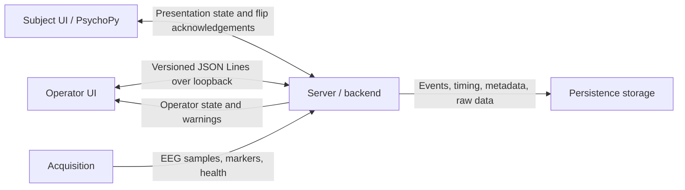

# Imagined Speech EEG recorder

Imagined Speech EEG recorder is a composed application for recording EEG data
during imagined-speech experiments. It brings together experiment
configuration, EEG acquisition, a PsychoPy subject display, a PyQt6 operator
console, live monitoring, timing safeguards, and validated session packages.

## Table of contents

- [Imagined Speech EEG recorder](#imagined-speech-eeg-recorder)
  - [Table of contents](#table-of-contents)
  - [Introduction](#introduction)
  - [Installation](#installation)
  - [Launch options](#launch-options)
  - [Operator features](#operator-features)
    - [Session setup](#session-setup)
    - [Protocol control](#protocol-control)
    - [Live monitoring](#live-monitoring)
    - [Session completion](#session-completion)
  - [Application components and architecture](#application-components-and-architecture)
    - [Communication flow](#communication-flow)
    - [Recording lifecycle](#recording-lifecycle)
  - [Experiment and data model](#experiment-and-data-model)

## Introduction

The goal of the software is to give a researcher a controlled environment for
recording EEG data from a subject. Guardrails guide the operator through
configuration, resource validation, display selection, audio readiness,
timing preflight, protocol control, and session finalization before research
data is accepted as complete.

The operator has a dedicated console with session controls and live views of
the recording process. The subject has a separate PsychoPy display that shows
only the experiment presentation. Operator diagnostics, acquisition state,
protocol controls, widgets, and warnings remain on the operator side.

The application records the protocol timeline, operator actions, acquisition
health, presentation timing, marker attempts, and raw EEG together so that a
session can be inspected and validated after recording.

## Installation

The supported environment is 64-bit Windows with Python 3.11. The package
requires Python `>=3.11,<3.12`, and the PsychoPy subject dependency is pinned
to `psychopy==2026.2.1`.

First set up virtual enviroment for project and then run:

```powershell
cd imagined-speech-psychopy
python -m .venv

#Windows: CMD
.venv\Scripts\activate

#Windows: PowerShell
.\.venv\Scripts\Activate.ps1

#Linux and MacOS
source .venv/bin/activate

pip install -e .
```

Install the application surfaces as needed:

```powershell
# Operator UI
pip install -e ".[ui]"

# PsychoPy subject UI
pip install -e ".[subject]"

# BrainFlow, NumPy/SciPy, and LSL acquisition
pip install -e ".[acquisition]"

# Everything, including development dependencies
pip install -e ".[all,dev]"
```

The base installation supports configuration, planning, validation, and
backend-only workflows. PsychoPy, PyQt6, and hardware integrations are
installed through their optional dependencies.

## Launch options

The installed command is `imagined-speech-psychopy`:

| Command                   | Purpose                                                           |
| ------------------------- | ----------------------------------------------------------------- |
| `validate`                | Validate an experiment YAML file and its referenced resources.    |
| `preview`                 | Show the protocol layout, balance, and projected duration.        |
| `simulate`                | Run a session and write a package without a live subject UI.      |
| `run`                     | Launch the operator workflow and the PsychoPy subject display.    |
| `run-subject`             | Launch a backend and subject process directly from CLI arguments. |
| `validate-session <path>` | Validate and reconstruct a saved session package.                 |
| `publish-lsl-synthetic`   | Publish a real-time synthetic EEG stream over LSL.                |

The simplest option is to use `run` and do everything through the operator UI:

```powershell
imagined-speech-psychopy run
```

The UI guides the operator through setup, subject initialization, protocol
control, monitoring, and session completion.

Common session options are available on `simulate`, `run`, and `run-subject`:

```powershell
imagined-speech-psychopy run `
  --config src/imagined_speech/resources/configs/cyton-four-phoneme.yaml `
  --participant P001 `
  --session-label baseline-01 `
  --output sessions
```

The common options are:

- `--config PATH` — experiment YAML path;
- `--participant ID` — participant identifier;
- `--session-label LABEL` — human-readable session label; and
- `--output PATH` — output root override.

Additional options:

- `simulate --clock virtual|real` selects deterministic or real-time execution;
- `run-subject --clock real` selects real-time subject execution;
- `run-subject --windowed` opens the subject display in a bounded window; and
- `run-subject --screen INDEX` overrides the configured screen index.

The bundled configurations are under
`src/imagined_speech/resources/configs`. The four-phoneme Cyton configuration
uses `/p/`, `/m/`, `/i/`, and `/u/` across balanced blocks. The short smoke
configuration is the default for validation and simulation.

## Operator features

The operator console has a setup scene and a protocol-control scene. It keeps
the researcher in control of the recording while the subject sees only
presentation content.

<!-- Screenshots of the setup and protocol-control scenes will be added here. -->

### Session setup

Before creating a recording, the operator can configure and verify:

- participant and session identifiers;
- experiment and acquisition-device profiles;
- output location and random seed;
- subject display and window mode;
- montage and audio readiness; and
- the compiled protocol preview, duration, and validation warnings.

Configuration is strict: unknown fields, invalid combinations, missing
resources, unsupported display settings, and incompatible acquisition options
are reported before recording begins.

### Protocol control

The protocol-control scene shows session, runtime, recording, protocol, phase,
progress, and output status. The primary action is **Init subject UI**. After
the subject connects and passes timing preflight, it becomes **Start protocol**.
When practice blocks are configured and the practice stage finishes, the action
becomes **Start experiment** so the operator explicitly begins the experiment
stage.

Available controls are:

- start the protocol;
- start the experiment stage when practice blocks are configured and complete;
- pause and resume while acquisition continues;
- repeat the current trial;
- repeat the current block;
- repeat the last practice trial;
- record an electrode-adjustment note; and
- abort the protocol and finalize the session.

Recovery actions are recorded as operator commands and protocol events. They do
not erase already-recorded EEG or event history.

### Live monitoring

The monitoring workspace is configurable through pane assignments and layouts.
The available widgets are:

- **Live EEG** — multichannel EEG traces;
- **Channel reception** — received-channel status and sample information;
- **Recent protocol markers** — recent semantic marker activity;
- **Operator command audit** — accepted and rejected command records; and
- **Acquisition and storage health** — recording, queue, source, and storage
  health warnings.

The operator can change layouts and pane assignments while recording continues.
Monitoring consumes copied state and does not control or modify persisted EEG.

### Session completion

After completion, abort, or controlled failure, the operator can inspect the
output path, export a session summary, return to setup, and begin another
session. Declared artifacts are registered and checksummed. Session validation
checks the manifest, event structure, plan reconstruction, acquisition data,
and artifact consistency.

## Application components and architecture

The application is composed of four main runtime components:

1. **Server/backend** — owns the session runtime, protocol state, acquisition
   lifecycle, persistence, validation, and finalization.
2. **Acquisition** — a backend-owned component that connects to synthetic,
   BrainFlow, Cyton, replay, or LSL sources; reads samples; records raw data;
   and reports health and markers.
3. **Subject UI** — a PsychoPy process that renders presentation-safe protocol
   state and acknowledges actual display flips.
4. **Operator UI** — a PyQt6 process for setup, controls, monitoring widgets,
   warnings, layouts, and session summaries.

### Communication flow



The server binds to an ephemeral loopback TCP port. The operator and subject
identify their roles when connecting. The server serializes runtime mutations
so the UI processes cannot independently change protocol truth.

### Recording lifecycle

1. The operator loads and validates experiment and device configuration.
2. The server creates a session identity and immutable plan snapshot.
3. The acquisition source is prepared and recording starts, including pre-roll.
4. The subject UI connects, resolves its display, and completes timing/audio
   preflight.
5. The operator starts the protocol. Subject presentation, EEG acquisition,
   markers, events, and monitoring proceed together.
6. The server records post-roll, stops acquisition, registers artifacts, writes
   final metadata, and validates the session package.

Visible presentation boundaries are committed by `Window.flip()` acknowledgements.
The persisted timing records include subject flip time, backend receipt time,
clock calibration, marker-attempt timing, frame intervals, and audio scheduling.

## Experiment and data model

Phase durations, stimuli, assets, repetitions, blocks, practice, marker codes,
presentation, montage, acquisition, and output paths are explicit in YAML. A
validated configuration is compiled into a deterministic plan before hardware
or a session directory is opened.

Supported acquisition paths are native synthetic, BrainFlow synthetic,
BrainFlow replay, Cyton, and LSL. Persisted EEG is recorded as-is and does not
go through processing before it is written.

Session packages can contain:

- configuration and compiled-plan snapshots;
- `events.jsonl`, the authoritative semantic timeline;
- `operator-actions.jsonl` and presentation timing records;
- raw EEG, acquisition markers, health, and acquisition metadata;
- `presentation-metadata.json`, frame intervals, and clock mappings; and
- checksums for all declared artifacts.
